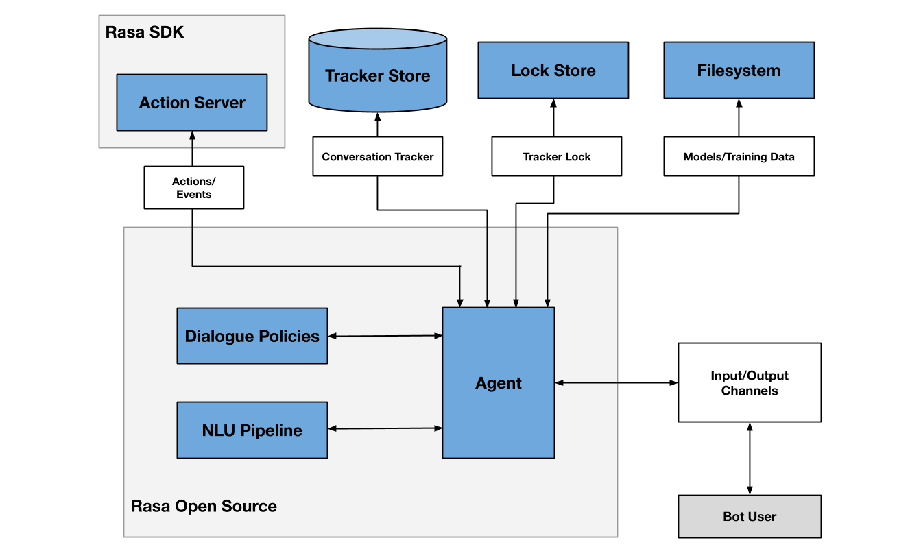

# Building a Banking Chatbot with Rasa

This repository provides a practical example of building and deploying a banking chatbot using Rasa, an open-source conversational AI framework. Follow along in GitHub Codespaces or set it up locally.

## What is Rasa?

Rasa is an open-source machine learning framework for building contextual AI assistants and chatbots. It provides tools to:

- Understand natural language (NLU - Natural Language Understanding)
- Maintain conversation state (Dialogue Management)
- Connect to messaging channels and APIs (Integrations)
- Execute custom business logic (Actions)

### Rasa Architecture

Rasa consists of two main components working together:

1. **Rasa Core** - The dialogue engine that predicts what should happen next in a conversation
2. **Rasa NLU** - The natural language understanding component that interprets user messages

Additionally, Rasa uses an **Action Server** that runs your custom code to perform business logic, API calls, database queries, or any other external interactions your bot needs. The action server communicates with the main Rasa server through a REST API.



### Key Rasa Commands

- `rasa init`: Create a new Rasa project with sample files
- `rasa train`: Train your NLU and dialogue models
- `rasa shell`: Talk to your bot directly in the terminal
- `rasa inspect`: Open the inspector UI to chat with your bot (GitHub Codespaces)
- `rasa run`: Start a server to expose your bot via API
- `rasa run actions`: Start the action server for custom actions
- `rasa data validate`: Check your training data for potential errors
- `rasa test`: Evaluate your bot's performance on test data

### How Rasa Works

Rasa processes conversations through a pipeline:

1. **User Input**: The user sends a message
   - Example: User sends "3 beers please"

2. **NLU Processing**:
   - Tokenization (splitting text into words/tokens)
     - Example: ["3", "beers", "please"]
   - Featurization (converting tokens into numeric features)
     - Example: Word vectors and embeddings for each token
   - Intent classification (identifying what the user wants)
     - Example: Intent recognized as `order_drink`
   - Entity extraction (identifying specific information in the message)
     - Example: Number entity "3" and drink entity "beers" extracted
     - Result: `{"intent": "order_drink", "entities": [{"value": "3", "entity": "quantity"}, {"value": "beers", "entity": "drink_type"}]}`

3. **Dialogue Management**:
   - Tracking conversation state using a tracker
     - Example: Tracker stores conversation history, current intent (`order_drink`), extracted entities (quantity: 3, drink_type: beers), and active form if any
   - Predicting the next action based on the conversation history
     - Example: Based on the `order_drink` intent and extracted entities, the dialogue manager predicts `action_confirm_order` as the next action
   - Executing the predicted action (responding to the user or calling custom code)
     - Example: The system executes `action_confirm_order` to process the drink order

4. **Response Generation**:
   - Sending a text response to the user
     - Example: "I've added 3 beers to your order. Would you like anything else?"
   - Or executing a custom action that might involve external systems
     - Example: A custom action could update an order database, check inventory, or calculate the total price

Let's trace a full conversation example:
```
User: "3 beers please"
NLU: Identifies intent as "order_drink" with entities {quantity: "3", drink_type: "beers"}
Tracker: Updates with new intent and entities
Policy: Predicts "action_confirm_order" should be next
Action: Executes "action_confirm_order", which confirms the drink order
Bot: "I've added 3 beers to your order. Your total is $15. Would you like anything else?"
User: "No thanks"
NLU: Identifies intent as "deny"
Tracker: Updates with new intent
Policy: Predicts "action_finalize_order" based on conversation context
Action: Executes "action_finalize_order"
Bot: "Your order is confirmed. Your order number is #1234."
```

Key files in a Rasa project:
- `domain.yml`: Defines intents, entities, slots, responses, and actions
  - Example: Defines `order_drink` intent, `quantity` and `drink_type` entities, and responses like `utter_confirm_order`
- `data/nlu.yml`: Contains training examples for each intent
  - Example: For `order_drink` intent: "I want [two](quantity) [coffees](drink_type)", "Get me a [beer](drink_type)"
- `data/stories.yml`: Example conversations for training the dialogue model
  - Example: Story showing a user ordering drinks, adding to order, and completing purchase
- `data/rules.yml`: Defines absolute conversation patterns
  - Example: Rule that always responds with payment options when intent `ask_payment_methods` is detected
- `config.yml`: Configuration for the NLU and Core pipelines
  - Example: Specifies tokenizers, entity extractors, and policies used by the model
- `actions/actions.py`: Custom action code for business logic
  - Example: `ActionConfirmOrder` class that checks inventory and calculates price
- `endpoints.yml`: Configuration for connecting to the action server and other services
  - Example: URL and authentication for the action server, database connections

## Using GitHub Codespaces

GitHub Codespaces provides a complete, pre-configured development environment in the browser, making it easy to work with this project without setting up your local environment.

### Why Use Codespaces?

- **Zero Setup**: Everything is preconfigured
- **Consistent Environment**: Everyone gets the same environment
- **Accessible**: Work from any computer with a browser
- **Resource Efficient**: Uses cloud resources, not your local machine

### Getting Started with Codespaces

1. **Create a Codespace:**
   - Click the green "Code" button on this repository page
   - Select "Codespaces" tab
   - Click "Create codespace on main"

2. **Set Up Environment:**
   ```
   source .venv/bin/activate
   ```

3. **Train the Model:**
   ```
   cd banking_chatbot
   rasa train
   ```

4. **Talk to your Bot:**
   ```
   rasa inspect
   ```
   GitHub will show a notification - click the green button to open the inspector where you can chat with the bot.

> **Note**: The first build in Codespaces may take several minutes as it needs to install dependencies and train the model.

## Local Setup (Alternative)

If you prefer working locally:

1. **Clone the repository:**
   ```
   git clone https://github.com/yourusername/rasa-example.git
   cd rasa-example
   ```

2. **Create and activate a virtual environment:**
   ```
   python -m venv .venv
   source .venv/bin/activate  # On Windows: .venv\Scripts\activate
   ```

3. **Install Rasa:**
   ```
   pip install rasa
   ```

4. **Train and run the bot:**
   ```
   cd banking_chatbot
   rasa train
   rasa shell
   ```

## Banking Chatbot Example

This repository includes a sample banking chatbot that demonstrates several key Rasa concepts. The bot can:
- Check account balances (with account type specification)
- Send money to recipients (using forms to collect required information)
- Handle basic conversation (greetings, chitchat, goodbyes)
- Manage out-of-scope requests

### How the Banking Chatbot Components Work Together

#### 1. Intent Recognition from NLU Data

The `data/nlu.yml` file defines intents with example utterances:

```yaml
- intent: query_balance
  examples: |
    - what's my balance
    - how much money do I have
    - check my account balance
    - what's my [checking](account_type) balance
    - how much do I have in [savings](account_type)
```

Here, the `[checking](account_type)` annotation marks "checking" as an entity of type "account_type", which will be extracted when a user mentions it.

#### 2. Response Templates in Domain

The `domain.yml` file defines responses that the bot can use:

```yaml
responses:
  utter_greet:
    - text: "Hello! I'm your banking assistant. How can I help you today?"
    - text: "Hi there! Welcome to our banking service. What would you like to do?"
  
  utter_goodbye:
    - text: "Goodbye! Have a great day."
    - text: "Thanks for using our banking service. Goodbye!"
```

These templates allow for variation in responses to make the bot feel more natural.

#### 3. Rules for Simple Mappings

The `data/rules.yml` file contains direct mappings from intents to actions:

```yaml
rules:
  - rule: Greet user
    steps:
      - intent: greet
      - action: utter_greet

  - rule: Query balance
    steps:
      - intent: query_balance
      - action: action_check_balance
```

Rules are straightforward and predictable, always executing the same action when a particular intent is detected.

#### 4. Stories for Conversation Flows

The `data/stories.yml` file defines more complex conversation patterns:

```yaml
stories:
  - story: Greet and check balance
    steps:
      - intent: greet
      - action: utter_greet
      - intent: query_balance
      - action: action_check_balance
      - intent: goodbye
      - action: utter_goodbye
```

Stories help the bot learn longer conversation flows and context-dependent behavior.

#### 5. Custom Actions for Business Logic

The `actions/actions.py` file contains custom Python code:

```python
class ActionCheckBalance(Action):
    def name(self) -> Text:
        return "action_check_balance"

    def run(self, dispatcher: CollectingDispatcher,
            tracker: Tracker,
            domain: Dict[Text, Any]) -> List[Dict[Text, Any]]:
        
        balance = round(random.uniform(100, 10000), 2)
        formatted_balance = f"${balance:,.2f}"
        account_type = tracker.get_slot("account_type")
        
        if account_type:
            message = f"Your {account_type} account balance is {formatted_balance}."
        else:
            message = f"Your current balance is {formatted_balance}."
        
        dispatcher.utter_message(text=message)
        
        return []
```

This action generates a random balance and customizes the response based on account type.

#### 6. Forms for Collecting Required Information

The banking bot uses forms to collect required information for sending money:

```yaml
forms:
  send_money_form:
    required_slots:
      - recipient
      - amount
```

The form automatically prompts for missing information using responses like:

```yaml
utter_ask_recipient:
  - text: "Who would you like to send money to?"
  
utter_ask_amount:
  - text: "How much would you like to send?"
```

### Configuration Details

The `config.yml` file defines the NLU pipeline and policies:

```yaml
pipeline:
  - name: WhitespaceTokenizer
  - name: RegexFeaturizer
  - name: LexicalSyntacticFeaturizer
  - name: CountVectorsFeaturizer
  - name: DIETClassifier
    epochs: 100
  - name: EntitySynonymMapper
  - name: FallbackClassifier
    threshold: 0.3

policies:
  - name: MemoizationPolicy
  - name: RulePolicy
  - name: TEDPolicy
    max_history: 5
    epochs: 100
```

- **Pipeline Components**:
  - `WhitespaceTokenizer`: Splits text into tokens by whitespace
  - `RegexFeaturizer`: Extracts features using regular expressions
  - `DIETClassifier`: Main model for intent classification and entity extraction
  - `FallbackClassifier`: Triggers fallback when confidence is low

- **Policies**:
  - `MemoizationPolicy`: Memorizes exact conversation patterns
  - `RulePolicy`: Handles simple mappings defined in rules.yml
  - `TEDPolicy`: Learns complex patterns from story examples

### Example Interactions

Try these examples to see how the bot handles different scenarios:

- **Balance Check**:
  - "What's my balance?"
  - "How much do I have in my savings account?"
  - "Check my checking account balance"

- **Sending Money (Full Information)**:
  - "I want to send $100 to John"

- **Sending Money (Partial Information)**:
  - "Send money to Sarah" (bot will ask for amount)
  - "Transfer $50" (bot will ask for recipient)

- **Conversation Flow**:
  - "Hello" → "What's my balance?" → "Goodbye"
  - "Hi" → "Who are you?" → "Send money to Mom" → "50 dollars" → "Thanks"

## Deploying to Render

After forking this repository, you can deploy it to Render with these steps:

1. **Fork this repository** to your GitHub account

2. **Sign up for Render** (https://render.com) if you haven't already

3. **Create a new Web Service:**
   - Click "New+" and select "Web Service"
   - Connect your GitHub account and select your forked repository
   - Render will automatically detect the Docker configuration

4. **Configure the service:**
   - Name: `banking-chatbot` (or your preferred name)
   - Environment: `Docker`
   - Branch: `main` (or your preferred branch)
   - Plan: `Free`
   - Leave all other settings as default

5. **Deploy:**
   - Click "Create Web Service"
   - Wait for the build to complete (this may take a few minutes)

6. **Access your bot:**
   - Once deployed, your bot will be available at the URL provided by Render
   - You can interact with it via API calls to this endpoint

The included `render.yaml` file already configures your service to run with:
```yaml
services:
  - type: web
    name: banking-chatbot
    env: docker
    plan: free
    startCommand: rasa run --enable-api --cors "*" --port $PORT
    envVars:
      - key: PORT
        value: 5005
```

This enables automatic deployment when you push changes to your repository.
